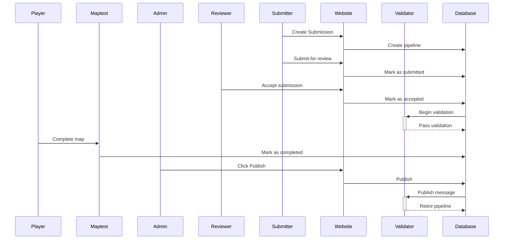

```mermaid
sequenceDiagram
    participant Player
    participant Maptest
    participant Admin
    participant Reviewer
    participant Submitter
    participant Website
    participant Validator
    participant Database

    Submitter->>Website: Create Submission
    Website->>Database: Create pipeline
    Submitter->>Website: Submit for review
    Website->>Database: Mark as submitted
    Reviewer->>Website: Accept submission
    Website->>Database: Mark as accepted
    Database->>+Validator: Begin validation
    Validator-->>-Database: Pass validation
    Player->>Maptest: Complete map
    Maptest->>Database: Mark as completed
    Admin->>Website: Click Publish
    Website->>Database: Publish
    Database->>+Validator: Publish message
    Validator-->>-Database: Retire pipeline
```
